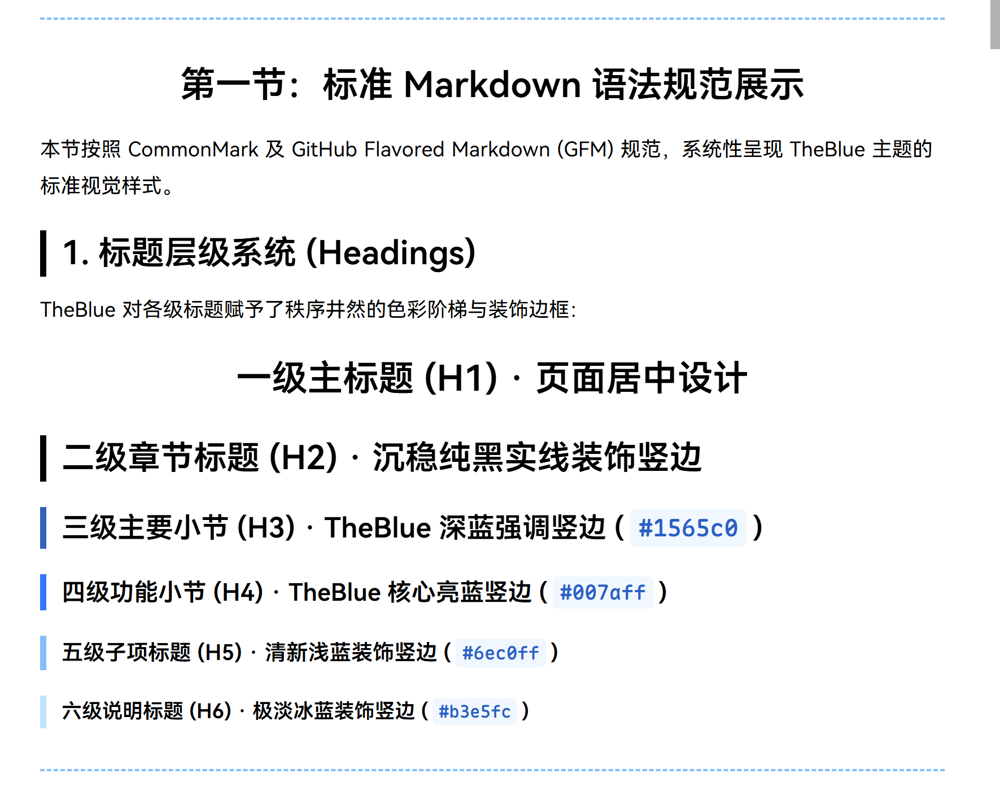
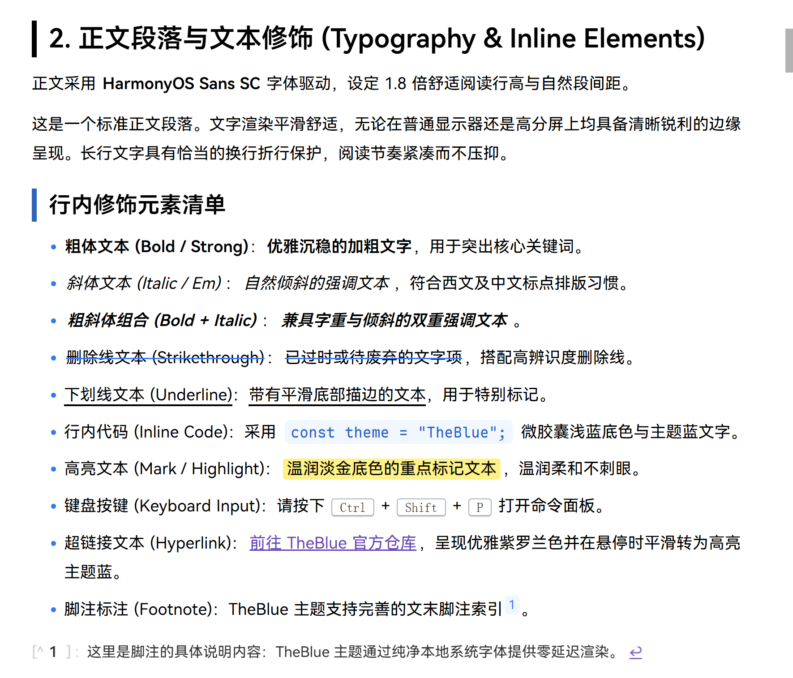
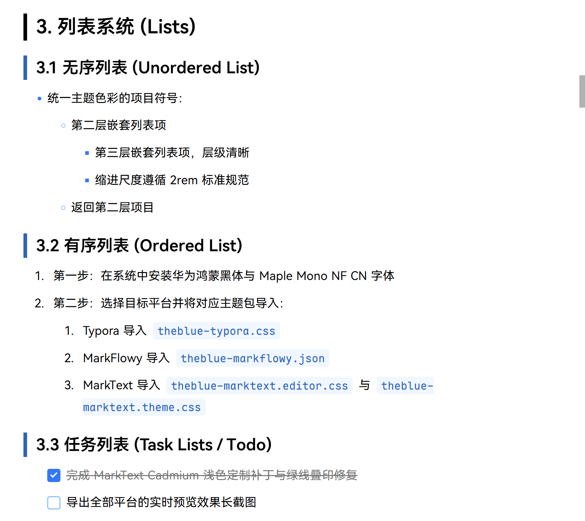
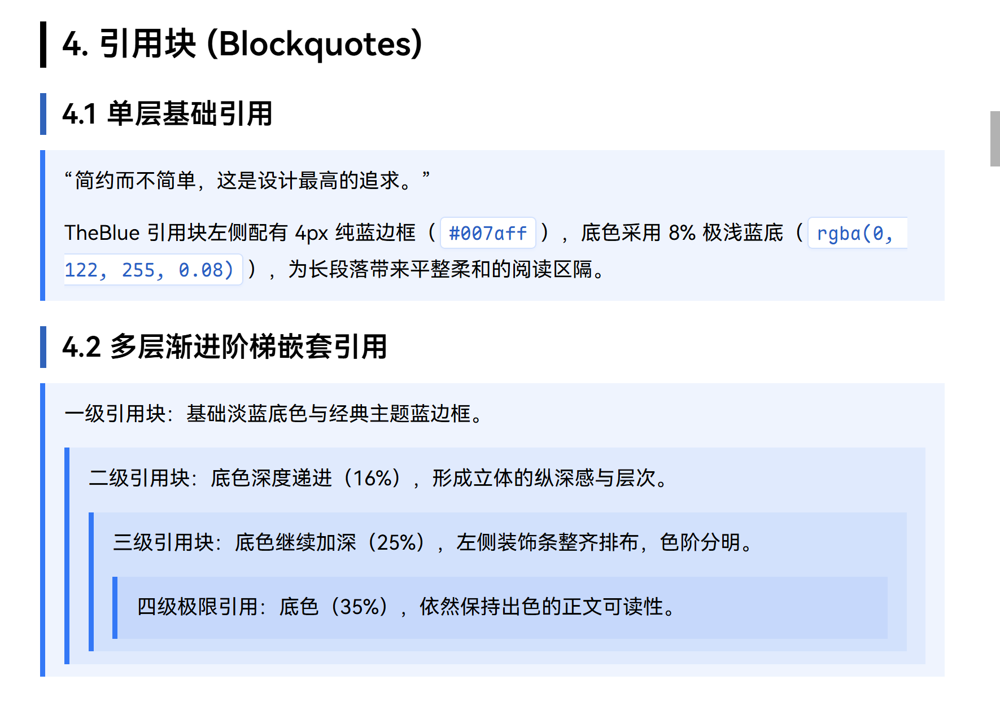
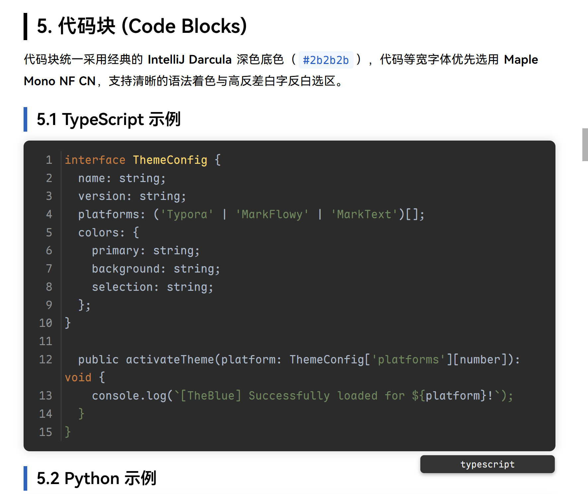
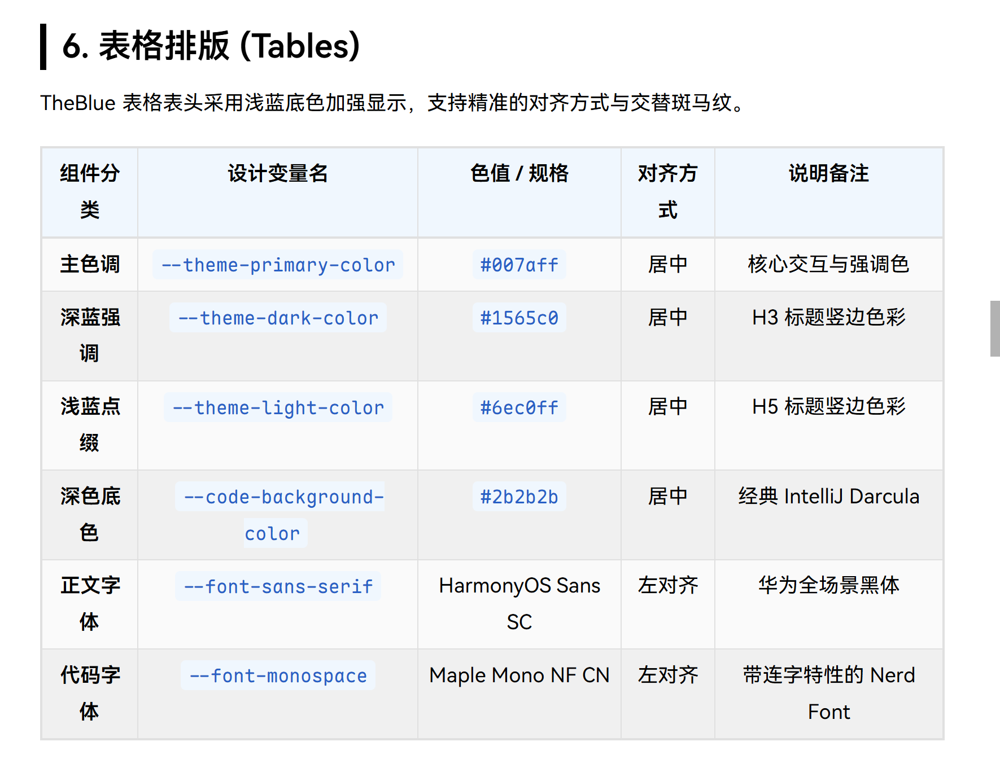
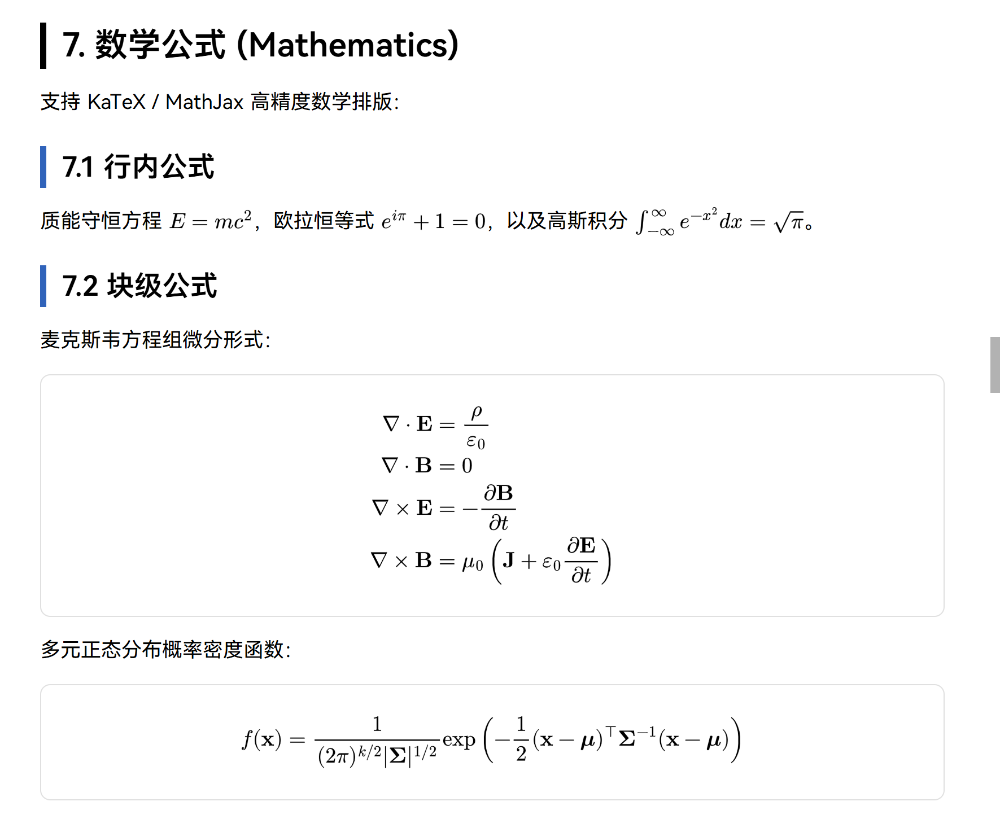
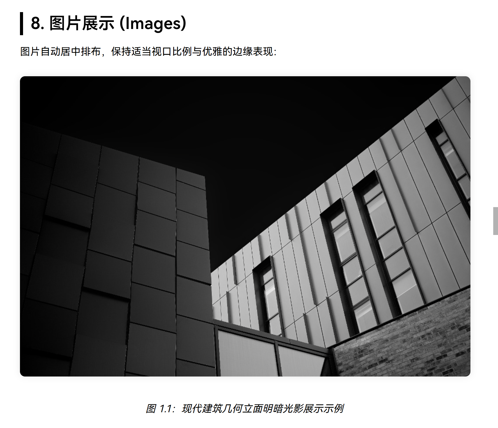
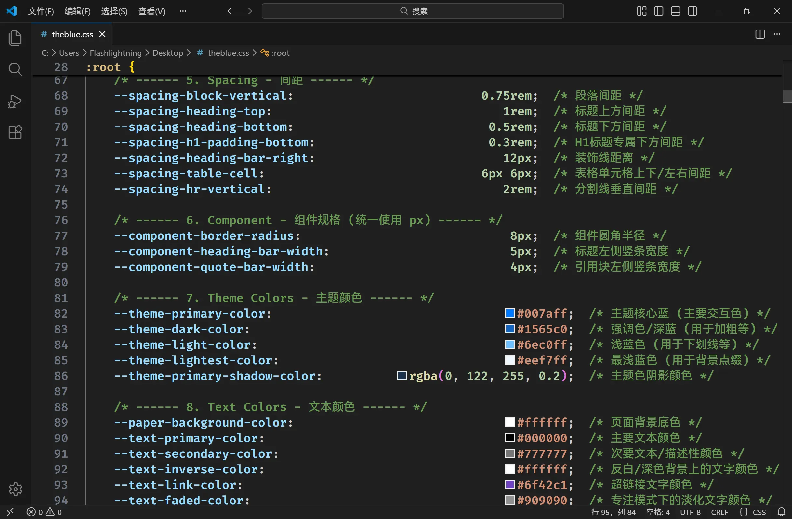

# TheBlue · 全平台通用 Markdown 蓝色系主题

**适用于 Typora、MarkFlowy 与 MarkText 的专业级蓝色系 Markdown 主题**

TheBlue 最初由 [CMOS4000](https://github.com/CMOS4000/TheBlue) 基于 [Pink Hsiao](https://github.com/HsiaoDeepie/typora-theme-pink-hsiao) 与 [Drake](https://github.com/liangjingkanji/DrakeTyporaTheme) 主题改编重构。经过深度调优、边界算法升级与全平台架构适配，现已原生支持 **Typora**、**MarkFlowy** 与 **MarkText** 三大主流桌面 Markdown 编辑器。

专为长文写作、技术笔记、知识沉淀与出版级 PDF 导出设计。

---

## 项目介绍

### 1. 设计理念与视觉秩序
* **层次分明的蓝色阶梯**：以 TheBlue 核心亮蓝（`#007aff`）为主色调，以深蓝强调色（`#1565c0`）和浅蓝点缀色（`#6ec0ff`）为辅助，赋予 H2~H6 标题清晰的彩色实线左边框；H1 保持干净利落的水平居中设计。
* **渐进嵌套立体引用**：
  * **Typora & MarkText**：引用块逐级嵌套呈现递进加深的浅蓝底色（8% → 16% → 25% → 35%），内部行内代码采用纯白微胶囊反差排版，层次立体分明；
  * **MarkFlowy**：突破扁平同级 DOM 渲染局限，首创复合阶梯渐变算法，精确锁定 1em/2em/3em 边界色标，彻底杜绝外层深色背景向左溢出竖线的历史难题。
* **沉浸式经典代码块**：全平台采用 IntelliJ Darcula（`#2b2b2b`）深色背景，搭配清晰的语法高亮与深蓝底纯白字的高反差选区。
* **高阶混叠与细节打磨**：
  * **高亮与代码无缝融合**：高亮 `<mark>` 与行内代码交叉混叠时，自动透明化底色并加深字色，消除两侧黄边与毛刺；
  * **数学公式描边加粗**：MathJax / KaTeX 公式 SVG 进行针对性字重补偿，与正文字重完美平衡；
  * **任务列表穿透删除线**：勾选任务自动触发灰色文字与平滑删除线。
* **原生轻量纯净架构**：全平台彻底取消外部 WOFF2 字体包绑定，完全由操作系统底层直出调用，保持代码仓库超轻量、零运行时性能损耗。

---

## 排版渲染效果展示

> **说明**：以下效果图取自 **Typora** 平台的实机渲染效果，分别对应测试文档 [`theblue-preview.md`](theblue-preview.md) 第一节中的 8 大标准语法排版规范。
>
> ⚠️ **跨平台渲染差异提示**：由于三大桌面 Markdown 编辑器采用的渲染引擎与 DOM 架构不同（Typora 基于 Electron 标准 DOM 树、MarkFlowy 基于 Tauri + WebView2 的 Capricorn 扁平网格引擎、MarkText 基于 Muya 虚拟块编辑引擎），MarkFlowy 与 MarkText 在个别组件（如网格表格行容器、动态选区、行内公式微调）上的视觉细节可能会因引擎机制差异而略有不同，均属平台正常表现。

### 1. 标题层级系统 (Headings)
H1 干净居中，H2~H6 呈现层次分明的色彩阶梯与实线装饰竖边。

### 2. 正文段落与行内文本修饰 (Typography & Inline Elements)
华为鸿蒙黑体驱动，舒适行高；加粗、斜体、删除线、下划线、微胶囊行内代码、淡金高亮、按键标识与超链接。

### 3. 列表与任务清单系统 (Lists & Task Lists)
主题色彩项目符号、多级递进有序列表与支持划掉删除线的任务列表。

### 4. 引用块与阶梯多层嵌套 (Blockquotes)
单层基础淡蓝底色与经典主题蓝边框，多层嵌套呈现逐级加深的立体纵深阶梯色阶。

### 5. 经典 IntelliJ Darcula 代码块 (Code Blocks)
`#2b2b2b` 沉浸式深色底色，搭配 Maple Mono NF CN 连字等宽字体与高对比度语法着色。

### 6. 表格排版 (Tables)
表头清晰增强显示，规整的单元格间距与舒适的数据对比度。

### 7. 数学公式排版 (Mathematics)
支持 KaTeX / MathJax 高精度排版，行内公式自适应对齐，块级公式独立居中。

### 8. 图文混排展示 (Images)
图片自动居中排布与自适应视口比例，保持典雅的边缘与版面节奏。

---

## 注意事项

### 1. 必装系统字体（关键）
为保证最佳字形清晰度、连字特性与排版比例，使用前**必须在操作系统中安装以下两款免费字体**：
* **正文字体**：[华为鸿蒙黑体 (HarmonyOS Sans SC)](https://developer.huawei.com/images/download/general/HarmonyOS-Sans.zip)
* **等宽代码字体**：[Maple Mono NF CN (带连字 Nerd Font 中文版)](https://github.com/subframe7536/maple-font/releases)

*注：本主题在全平台均使用 CSS `@font-face { src: local(...) }` 规则直接调用系统已安装字体。若未安装上述字体，系统将自动安全回退至系统默认无衬线字体与等宽字体。*

### 2. PDF 导出与打印建议 (`@media print`)
* 本主题在全平台深度配置了打印样式规范：
  * 具备严格的**标题防孤行保护**（标题绝不会被孤留在页面底部）；
  * 代码块、表格、公式块等复合组件全面启用跨页防腰斩保护（`break-inside: avoid`）。
* **推荐打印 / PDF 导出参数**：
  * 纸张规格：**A4**
  * 页边距建议：**上下 12mm，左右 8mm**

### 3. 语义化参数调参指南
CSS 与主题 Token 均严格遵循如下语义化命名规范，方便用户或二次开发者在 `:root {}` 中快速调整：
> **`--[scope]-[role]-[property]`**
>
> * **scope**：作用域/结构（如 `theme`, `font`, `layout`, `spacing`, `border`, `code`）
> * **role**：语义/用途（如 `primary`, `h1`, `write`, `block`）
> * **property**：属性名（如 `color`, `size`, `width`, `radius`）

### 4. 图片资源管理
本项目中的 Markdown 文档如需插入图片，均推荐统一存放在根目录下的 [`img/`](img/) 文件夹中，便于通过相对路径稳定引用与跨平台移植。

---

## 三平台安装指南

本项目各平台主题文件独立存放、严格隔离，请根据您使用的软件按需安装：

| 平台 | 主题文件位置 | 格式与特点 |
| :--: | :--: | :--: |
| **Typora** | [`Typora/theblue-typora.css`](Typora/theblue-typora.css) | 独立 CSS 主题文件，全面修订 |
| **MarkFlowy** | [`MarkFlowy/theblue-markflowy.json`](MarkFlowy/theblue-markflowy.json) | 官方 1.0.0 JSON 规范，浅色/深色双模一体 |
| **MarkText** | [`MarkText/theblue-marktext.css`](MarkText/theblue-marktext.css) | 适配 Cadmium 浅色主题，复制到自定义CSS即可生效 |

---

### Typora 安装步骤

1. 打开 Typora，点击菜单栏：**文件 → 偏好设置 → 外观 → 打开主题文件夹**。
2. 将本仓库 [`Typora/`](Typora/) 目录下的 [`theblue-typora.css`](Typora/theblue-typora.css) 文件复制到打开的主题文件夹中。
3. 重启 Typora，在菜单栏 **主题 (Themes)** 下拉菜单中勾选 **theblue-typora** 即可生效。

---

### MarkFlowy 安装步骤

1. 打开 MarkFlowy 客户端。
2. 进入：**设置 (Settings) → 扩展 (Extensions) → 自定义主题 (Custom Theme)**。
3. 点击 **导入主题 (Import Theme)** 按钮，选择本仓库 [`MarkFlowy/`](MarkFlowy/) 目录下的 [`theblue-markflowy.json`](MarkFlowy/theblue-markflowy.json) 文件。
4. 导入成功后，在主题列表中启用 **TheBlue** 即可（支持随系统或偏好在浅色与深色之间自由切换）。

---

### MarkText 安装步骤

MarkText 官方自定义主题机制尚在完善中，推荐采取“追加/覆盖至 Cadmium 浅色主题”的方式快速启用：

1. 打开 MarkText 客户端，在**文件 → 偏好设置 → 主题**中选择**Light**。
2. 将本仓库 [`MarkText/`](MarkText/) 目录下的 [`theblue-marktext.css`](MarkText/theblue-marktext.css) 文件中所有内容复制到下面的 **自定义CSS** 中。
3. 导入成功后，重启 MarkText 即可。

---

## 效果检验测试文档

仓库根目录下提供了全新编写的 [`theblue-preview.md`](theblue-preview.md) 综合排版测试文档：
* **第一节**：标准 Markdown 语法全特性展示（标题、正文、列表、任务清单、引用、代码高亮、表格、数学公式、图文）；
* **第二节**：极端复合混叠与边界兼容性压测（标题内行内代码与公式、多层嵌套引用块内嵌公式与代码块、高亮与代码无缝叠合、表格复杂排版、打印防截断等）。

建议在各平台安装完毕后，直接在编辑器中打开该文档验证主题的渲染保真度。

---

## 开源协议与致谢

* 本项目采用 [MIT 许可证](LICENSE) 开源。
* 感谢原作者 [CMOS4000](https://github.com/CMOS4000/TheBlue)、[Pink Hsiao](https://github.com/HsiaoDeepie/typora-theme-pink-hsiao) 与 [Drake](https://github.com/liangjingkanji/DrakeTyporaTheme) 的杰出工作！
